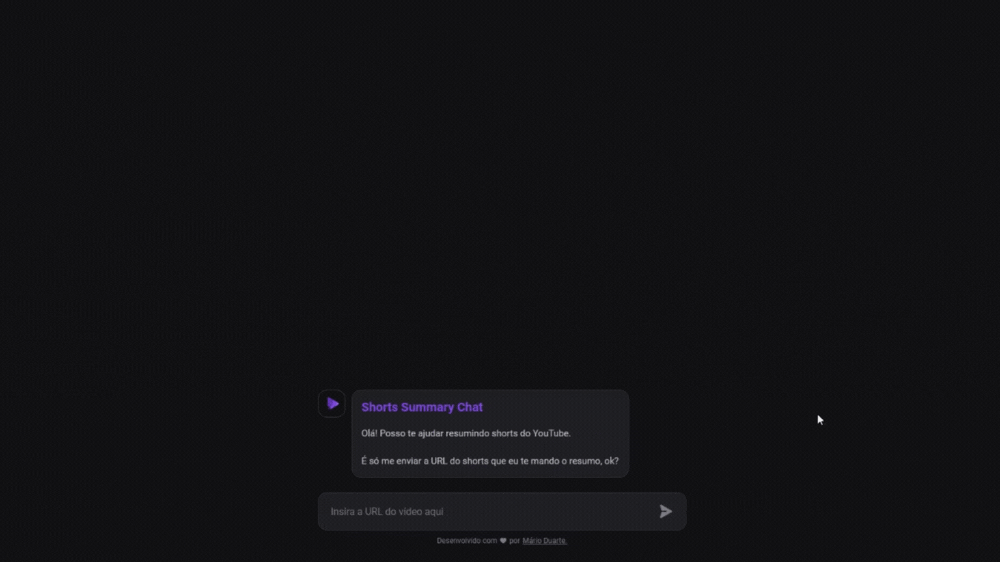

# Shorts Summary Chat <a href="#licença"></a>

Um chatbot que resume Shorts do YouTube.



## Sobre o projeto

Shorts Summary Chat é uma aplicação responsiva em formato de chat que permite aos usuários compartilharem a URL de um Shorts e, em troca, receberem um breve resumo do vídeo em questão.

Este projeto surgiu durante a realização do evento NLW IA, organizado pela Rocketseat. Inicialmente, a proposta era criar uma aplicação simples e estática, porém, decidi me desafiar ainda mais ao buscar inspiração na construção visual de chatbots famosos, como o Chat GPT e o Bing Chat, para o desenvolvimento desta aplicação.

## Tecnologias

Esse projeto foi desenvolvido com as seguintes tecnologias e ferramentas:
<br>

- Node.js
- HTML
- CSS
- JavaScript

## Como executar o projeto

### Pré-requisitos

Antes de começar, você precisa ter instalado em sua máquina as ferramentas [Git](https://git-scm.com), [Node.js](https://nodejs.org/en/), além de um bom editor de código como o [VSCode](https://code.visualstudio.com/).

### Rodando a aplicação

```bash
# Clone este repositório
$ git clone https://github.com/mariooduarte/shorts-summary-chat

# Acesse a pasta do projeto no seu terminal/cmd
$ cd shorts-summary-chat

# Instale as dependências
$ npm install

# Inicie a aplicação web
$ npm run web

# Inicie o servidor
$ npm run server
```

## Licença

Este projeto está sob a licença MIT.

Feito com ❤️ por **Mário Duarte**! 👋🏻 [Get in touch!](https://github.com/MariooDuarte)
